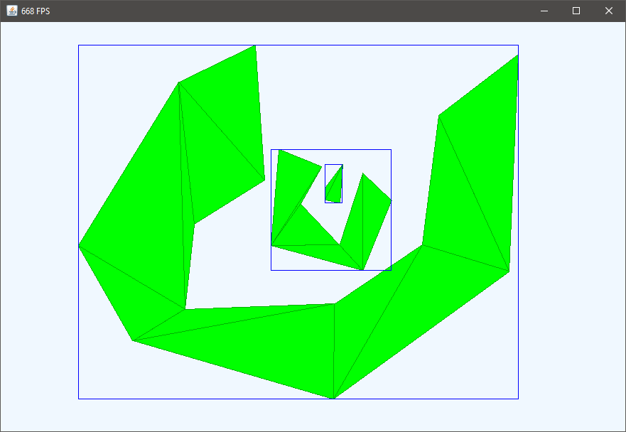

## Triangulated Polygon Collision
This is project from 2018. You can create polygons that get translated into a group of triangles. These triangles are used for collision testing. This project implements:

- Ear Clipping triangulation
- Separating Axis Theorem

### Controls
- left click: add point to the current (blue) polygon
- right click: end current polygon and triangulates it
- middle click: delete current polygon
- right drag: move polygon
- middle drag: move around
- scrollwheel: zoom